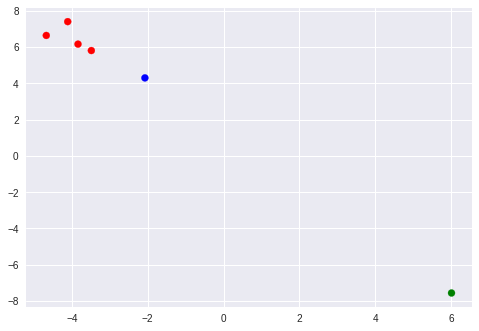

# Industrial contamination in the United States.
Exploration of the correlation between water contaminantion and industrial activity across US counties.

Author: Eric Zhao (2018).

### Motivations
Our goal is to better understand how chemical contaminant levels in water systems reflect industrial development and activity. Better understanding of such correlations empowers better informed policy making and a more complete understanding of the ramifications of economic development.

> While the populations with the least access to good water sources are largely clustered in 
> developing countries, recent events such as the Flint water crisis in Michigan and the 
> California drought remind us that even in economically advanced countries such as the 
> United States, careless public planning and negligent environmental regulations can still 
> threaten the public’s access to clean and safe public water supplies.

> Industrial and technological revolutions which have resulted in advanced manufacturing 
> processes, have slowly resulted in water pollution of nearby areas from the contaminants 
> and by-products released into the natural water sources. As we proceed with the 
> development of novel technologies, it is imperative that we continue to improve the quality 
> of life and access to safe drinking water.

> \- CorrelationOne


# Getting started...


```
import copy
import numpy as np
import pandas as pd
import matplotlib.pyplot as plt


from sklearn import linear_model
from sklearn.decomposition import PCA
from sklearn import manifold
from sklearn.cluster import KMeans
from sklearn.preprocessing import StandardScaler
```


### Datasets
**Chemicals**: Data containing the measured mean concentration of a particular chemical or substance in community water systems throughout the counties in the United States from 2000 – 2016. ~882,000 rows & 12 columns. Size: ~100MB. Source: [Centers for Disease Control and Prevention](https://ephtracking.cdc.gov/).

**Droughts**: Data containing the particular percentage of various range of drought severities, indexed by counties for particular start-end periods throughout the United States. ~1.35 million rows & 11 columns. Size: ~100MB. Source: [U.S. Drought Monitor](https://droughtmonitor.unl.edu/Data/DataDownload/ComprehensiveStatistics.aspx).

**Earnings**: Information about the industry specific median earnings (in that specific year’s USD, inflation adjusted) indexed by counties for all of the United States, taken from 2010 – 2016.  21,999 rows & 31 columns. Size: ~5MB. Source: [U.S. Census](https://factfinder.census.gov/faces/nav/jsf/pages/index.xhtml).

**Educational attainment**: Data containing the educational attainment of the US population by county from 1970 – 2000 and estimates of 2012 – 2016.  16,416 rows & 12 columns. Size: ~2MB. Source: [U.S. Department of Agriculture](https://www.ers.usda.gov/data-products/county-level-data-sets/download-data/).

**Industry occupation**: Data containing the estimated working population (16 years and over) for the various industries indexed by counties, taken from 2010 – 2016.  5,712 rows & 18 columns. Size: ~0.7MB. Source: [U.S. Census](https://factfinder.census.gov/faces/nav/jsf/pages/index.xhtml).

**Water usage**: Information about particular water usage (irrigation, public supply, crop, etc.) and thermoelectric power generated for counties that were found for the year 2010. 3,225 rows & 117 columns. Size: ~2MB. Source: [U.S. Department of the Interior](https://water.usgs.gov/watuse/data/2010/index.html).


```
raw_water_df = pd.read_csv("water_usage.csv")
raw_water_dict_df = pd.read_csv("water_usage_dictionary.csv")
raw_industry_df = pd.read_csv("industry_occupation.csv", encoding = "latin1")
raw_education_df = pd.read_csv("education_attainment.csv", encoding = "latin1")
raw_earnings_df = pd.read_csv("earnings.csv", encoding = "latin1")
raw_chemicals_df = pd.read_csv("chemicals.csv", encoding = "latin1")
raw_droughts_df = pd.read_csv("droughts.csv", encoding = "latin1")
```

# Modeling industrial activity...
To comprehensively correlate contamination patterns from 2010 to 2016 with industrial activity, we have to build a reliable model of industrial activity for each year. Our water usage dataset provides a direct window into the water consumption of different industries. However, the dataset is only available for 2010. We must therefore supplement our model of industrial activity with data on industry occupation figures, available each year from 2010 to 2016. Although occupation does not directly imply industrial activity as strongly as water usage, it provides information on industrial development that can be leveraged by our later models to compensate for our static water usage assumptions.

### Water Usage Data
Before we can use the water usage data, we need to remove a few sources of bias/noise from the dataset. The most obvious source of noise are drought patterns. As we anticipate water usage will vary based on a county's drought status, we must normalize for each county's drought status in 2010. We also anticipate overall population to affect water usage.

We first clean up our drought dataframe.


```
droughts_df = raw_droughts_df.copy()

# Parse the start and end dates.
droughts_df['valid_start'] = pd.to_datetime(droughts_df['valid_start'])
droughts_df['valid_end'] = pd.to_datetime(droughts_df['valid_end'])
droughts_df = droughts_df[droughts_df['valid_end'].dt.year >= 2010]
droughts_df = droughts_df[droughts_df['valid_start'].dt.year <= 2010]

# Remove non feature cols.
droughts_feature_cols = ["none", "d0", "d1", "d2", "d3", "d4"]
droughts_df = droughts_df[["fips", *droughts_feature_cols]]

# Scale the drought data
droughts_scaler = StandardScaler(with_mean=True, with_std=True)
droughts_scaler.fit(droughts_df.drop(columns=["fips"]))
droughts_df[droughts_feature_cols] = pd.DataFrame(
    droughts_scaler.transform(droughts_df.drop(columns=["fips"])),
                              columns=droughts_feature_cols)
```


```
water_df = raw_water_df.copy()
water_df = water_df.drop(columns=['state','state_fips','county','county_fips','year','population']).fillna(0)
water_feature_cols = [x for x in water_df.head(0) if x != "fips"]

water_scaler = StandardScaler(with_mean=True, with_std=True)
water_scaler.fit(water_df.drop(columns=["fips"]))
water_df[water_feature_cols] = pd.DataFrame(
    water_scaler.transform(water_df.drop(columns=["fips"])),
                              columns=water_feature_cols)
```


As a normalization technique, we train a ridge regression model from drought status and population to the water usage statistics. We then subtract the predicted water usage statistics from the true water usage statistics. If we removed the population features and switched to linear regression, this would be mathematically equivalent to removing the mean water usage for the specific drought status of a county.


```
def normalize_drought_pop(droughts_df, df):
  all_df = df.merge(droughts_df, on="fips").fillna(0)

  labels_df = all_df[water_feature_cols]
  features_df = all_df.drop(columns=["fips", *water_feature_cols])

  normalizer = linear_model.Ridge(alpha=0.5)
  normalizer.fit(features_df.values, labels_df.values)

  labels = np.subtract(labels_df.values, normalizer.predict(features_df.values))
  labels_df = pd.DataFrame(labels, columns=list(labels_df.head(0)))
  labels_df = labels_df.merge(all_df[["fips"]], left_index=True, right_index=True)

  return normalizer, labels_df
```


```
water_normalizer, water_df = normalize_drought_pop(droughts_df, water_df)
```

### Industrial Occupation Data
With the water usage data cleaned, we need to process the industrial occupation data. This occupation data will supplement our water usage data, and provide information on industrial development beyond 2010 (which the water usage data otherwise limits our understanding to).

A major challenge with industrial occupation data is extraneous information content. While the socioeconomic trends correlated with industrial occupation may improve contaminant modeling accuracy (ex higher median income means more tax revenue which means fewer contaminants), our goal is to isolate each county's industrial activity and development.

First, we need to preprocess the earnings data.


```
earnings_df = raw_earnings_df.copy()
earnings_df = earnings_df.drop(columns=["geo_id", "county"])

remove_signs = lambda x: int(str(x).strip()[:-1].replace(",", "")) if str(x).strip()[-1] in ("+", "-") else x
earnings_df = earnings_df.applymap(remove_signs).fillna(0)

earnings_feature_cols = [x for x in earnings_df.head(0) if x not in ("fips", "year")]

earnings_scaler = StandardScaler(with_mean=True, with_std=True)
earnings_scaler.fit(earnings_df.drop(columns=["fips", "year"]))
earnings_df[earnings_feature_cols] = pd.DataFrame(
    earnings_scaler.transform(earnings_df.drop(columns=["fips", "year"])),
                              columns=earnings_feature_cols)
```


```
industry_df = raw_industry_df.copy()
industry_df = industry_df.drop(columns=["geo_id", "county"]).fillna(0)

industry_feature_cols = [x for x in industry_df.head(0) if x not in ["fips", "year"]]

industry_scaler = StandardScaler(with_mean=True, with_std=True)
industry_scaler.fit(industry_df.drop(columns=["fips", "year"]))
industry_df[industry_feature_cols] = pd.DataFrame(
    industry_scaler.transform(industry_df.drop(columns=["fips", "year"])),
                              columns=industry_feature_cols)
```

To remove socioeconomic patterns from the industrial occupation data, we perform principal component analysis on a combination of the occupation and earnings dataframes. We then identify eigenvectors (components) that strongly correlate to earnings patterns and remove the corresponding eigenvector and singular value from our basis. We then recompute the full matrix and use the new industrial occupation data.


```
def normalize_earnings(earnings_df, df):
  all_df = df.merge(earnings_df, on=["fips", "year"]).fillna(0)
  feature_cols = list(all_df.drop(columns=["fips", "year"]).head(0))

  pca = PCA()
  pca.fit(all_df.drop(columns=["fips", "year"]).values)

  singular = pca.singular_values_
  components = pca.components_
  np.delete(singular, 3)
  np.delete(components, 3)

  inference = np.matmul(all_df.drop(columns=["fips", "year"]), singular * components)
  print(inference)
  all_df[feature_cols] = pd.DataFrame(inference, columns=feature_cols)
  return all_df[industry_feature_cols]
```


```
industry_df = normalize_earnings(earnings_df, industry_df)
```

Now we just concatenate the vectors!


```
industrial_profile_df = water_df.merge(industry_df, how="outer", on="fips")
```

## Modeling contaminent levels

To begin correlating the contaminant levels with industrial activity, we need to first preprocess our contaminant data.


```
""" Generate the contamination dataset """

chemicals_df = raw_chemicals_df.copy()

chemicals_dict = {}
for _, row in chemicals_df.iterrows():
  if (row["fips"], row["year"]) not in chemicals_dict:
    chemicals_dict[(row["fips"], row["year"])] = {}
  chemicals_dict[(row["fips"], row["year"])][(row["chemical_species"] + "(" + row["unit_measurement"] + ")")] = row["value"]
chemicals_list = []
for (fips, year), v in chemicals_dict.items():
  chemicals_list.append({"fips": fips, "year": year, **{k: v for k, v in v.items()}})

chemicals_df = pd.DataFrame(chemicals_list).fillna(0)
chemicals_feature_cols = [x for x in chemicals_df.head(0) if x not in ["fips", "year"]]

chemical_scaler = StandardScaler(with_mean=True, with_std=True)
chemical_scaler.fit(chemicals_df.drop(columns=["fips", "year"]))
chemicals_df[chemicals_feature_cols] = pd.DataFrame(
    chemical_scaler.transform(chemicals_df.drop(columns=["fips", "year"])),
                              columns=chemicals_feature_cols)

reverse_contaminant_normalization = lambda x: x * scaler.var_ + scaler.mean_
```

Now we have to overlap our chemicals and industrial profile data...


```
all_df = chemicals_df.merge(industrial_profile_df, on=["fips", "year"])
chemicals_corr_df = all_df[list(chemicals_df.head(0))]
industrial_profile_corr_df = all_df[list(industrial_profile_df.head(0))]
```

## Clustering chemicals based on correlation to industrial activity
We first build a regression model to measure what an increase/decrease in contaminants say about industrial activity. We then cluster chemicals based on how they relate to industrial profiles based on the similarity of regression coefficients.


```
"""
Given a dataset of feature vectors chemical contaminant levels, try to predict
the vector representing the industrial activity for a given county at a given
year. Cluster the chemicals based on the similarity of their correlations to
the industrial activity.
"""


chem_to_county = linear_model.LinearRegression()
chem_to_county.fit(chemicals_corr_df.drop(columns=["fips", "year"]).values, industrial_profile_corr_df.drop(columns=["fips", "year"]).values)
coefs = chem_to_county.coef_

kmeans = KMeans(n_clusters=3, random_state=0).fit(coefs)
coords = manifold.TSNE().fit_transform(coefs)

cluster_data = []
for i, chem_name in enumerate(chemicals_feature_cols):
  cluster_data.append({"chemical": chem_name, "assignment": kmeans.labels_[i],
                       "x": coords[i][0], "y": coords[i][1]})
cluster_df = pd.DataFrame(cluster_data)
```

We visualize the clusters in the cluster graph below.


```
color_map = ["b", "r", "g"]
plt.scatter(cluster_df["x"], cluster_df["y"], c=[color_map[x] for x in cluster_df["assignment"].tolist()])
```


    <matplotlib.collections.PathCollection at 0x7f610e49fdd8>





## Associating contamination estimations with industrial profiles
We then build a regression model from contaminants to changes in industrial activity (instead of the value at a given year). We perturb the regression inputs to view how economic development reflects in typical contamination levels for such economies.


```
PERTURB_COLS = ["pub_sup_10"]
DELTA = 0.5
```


```
"""
Given a dataset of feature vectors representing the industrial activity
for a given county at a given year, try to predict the chmemical contaminant
level. What happens to contaminant levels when we perturb the county vectors?
"""

industrial_profile_corr_df = industrial_profile_corr_df.copy()

county_to_chem = linear_model.Ridge(alpha = .5)
county_to_chem.fit(industrial_profile_corr_df.drop(columns=["fips", "year"]).values, chemicals_corr_df.drop(columns=["fips", "year"]).values)
old_preds = county_to_chem.predict(industrial_profile_corr_df.drop(columns=["fips", "year"]).values)
industrial_profile_corr_df[PERTURB_COLS] += DELTA
new_preds = county_to_chem.predict(industrial_profile_corr_df.drop(columns=["fips", "year"]).values)
new_preds - old_preds
```


    array([[ 5.29759519e-05,  7.25715443e-03, -1.08969950e-02,
            -6.18232296e-02,  1.23471812e-02, -1.59188326e-03],
           [ 5.29759519e-05,  7.25715443e-03, -1.08969950e-02,
            -6.18232296e-02,  1.23471812e-02, -1.59188326e-03],
           [ 5.29759519e-05,  7.25715443e-03, -1.08969950e-02,
            -6.18232296e-02,  1.23471812e-02, -1.59188326e-03],
           ...,
           [ 5.29759519e-05,  7.25715443e-03, -1.08969950e-02,
            -6.18232296e-02,  1.23471812e-02, -1.59188326e-03],
           [ 5.29759519e-05,  7.25715443e-03, -1.08969950e-02,
            -6.18232296e-02,  1.23471812e-02, -1.59188326e-03],
           [ 5.29759519e-05,  7.25715443e-03, -1.08969950e-02,
            -6.18232296e-02,  1.23471812e-02, -1.59188326e-03]])


